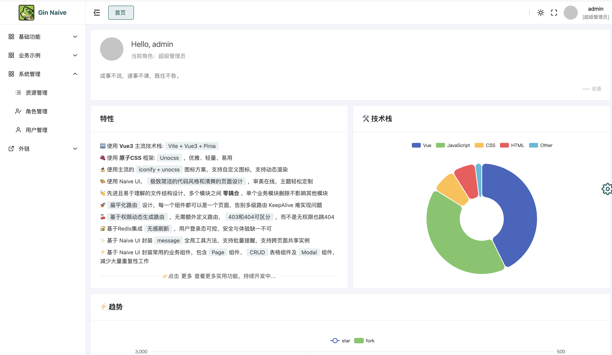

# gin-naiveui



## [api 接口](./api.md)

## 本地运行

#### 使用 docker 运行

修改 .env 文件数据库连接参数

```
DB_PORT=5432
DB_USER=example_user
DB_PASSWORD=example_password
DB_NAME=ginnaive
SECRET=example_secret
```

```shell
docker compose up
```

docker中会启动一个数据库，然后把当前golang项目都打包进容器里面运行。

在 Dockerfile 中使用了 github.com/air-verse/air@latest 这个库。
修改 golang 代码之后无需重启，可以热更新。

如果数据库中没有文件，那么会自动创建初始化数据。

##### 运行前端

```shell
cd vue-naive-admin && pnpm install && pnpm run dev
```
